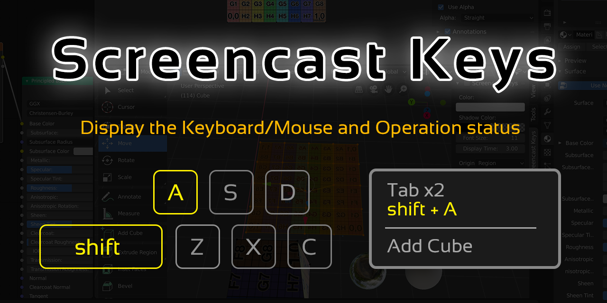

# Blender Add-on: Screencast Keys

This is a blender add-on **Screencast Keys** to display the Keyboard/Mouse and
Operation status.

*To realize the long support of this add-on, your support is helpful.*
*You can support the development of this add-on via*
**[GitHub Sponsors](https://github.com/sponsors/nutti)** *or*
**[Blender Market](https://blendermarket.com/products/screencast-keys)**.
*See [the contribution document](CONTRIBUTING.md) for the detail of*
*the support.*

## Download / Installation

Before installing Screencast Keys add-on, check if
[the add-on version](docs/installation.md#support-version) supports on the your
Blender version.

All released Screencast Keys add-on is available on
[Release Page](https://github.com/nutti/Screencast-Keys/releases).  
If you want to try newest (unstable) version, you can download it from
[unstable version](https://github.com/nutti/Screencast-Keys/archive/master.zip).

Installation process is a bit confusing.  
See [Document](docs/installation.md) if you have any trouble to install this
add-on.

## Features

Screencast Keys supports **English** only.  
The features of this add-on are as follows.

* Display Keyboard/Mouse status
* Display Operation executed last time
* Change area/region/window to display status
* Customize UIs

## Tutorials

See [Document](docs/tutorial.md) to know the details of this add-on.

## Change Log

See [CHANGELOG.md](CHANGELOG.md)

## Bug report / Feature request / Disscussions

If you want to report bug, request features or discuss about this add-on, see
[ISSUES.md](ISSUES.md).

We provide [the answers](docs/faq.md) for the frequently asked questions.
See these answers before making bug reports.  
If you want to have an interactive discussion, you can use
[screencast-keys channel](https://discord.gg/dGU9et5S2d) on the Discord server.

## Contribution / Support

If you want to contribute to or support this project, see
[CONTRIBUTING.md](CONTRIBUTING.md).

## Project Authors

### Owner

[**@nutti**](https://github.com/nutti)

Indie Game/Application Developer.  
Especially, I spend most time to improve Blender and Unreal Game Engine via
providing the extensions.

Support via [GitHub Sponsors](https://github.com/sponsors/nutti)

* CONTACTS: [Twitter](https://twitter.com/nutti__)
* WEBSITE: [Japanese Only](https://colorful-pico.net/)

### Contributors

Thanks for the contribution to this project.

* [**@Hawkpath**](https://github.com/Hawkpath)
* [**@kant**](https://github.com/kant)
* [**@CheeryLee**](https://github.com/CheeryLee)
* [**@Kureii**](https://github.com/Kureii)

### Sponsors

Thanks for the sponsoring this project.

* Joel E White
* theangelik1art
* Stanley Creative
