# Tutorial

* [Introduction (Video)](#introduction-video)
* [Screenshots](#screenshots)
* [Options](#options)
* [Preferences](#preferences)
* [Shortcut Keys](#shortcut-keys)

## Introduction (Video)

This video is created for v3.0.

*NOTE: UI and features introduced in this video will be changed in the future release.*

## Screenshots

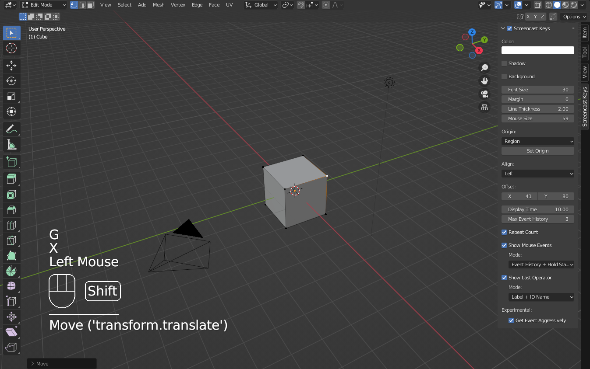

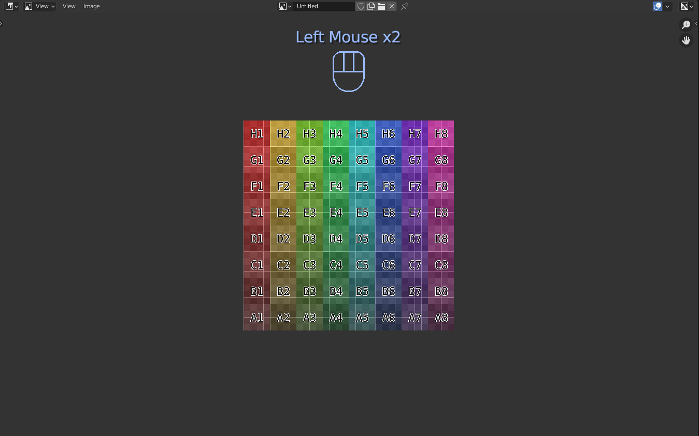

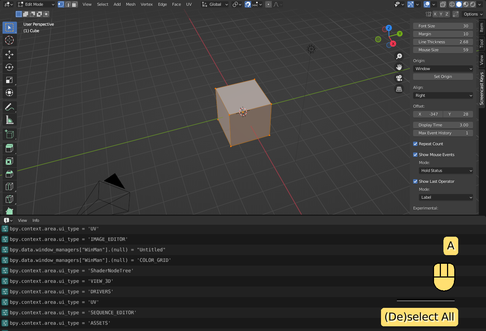

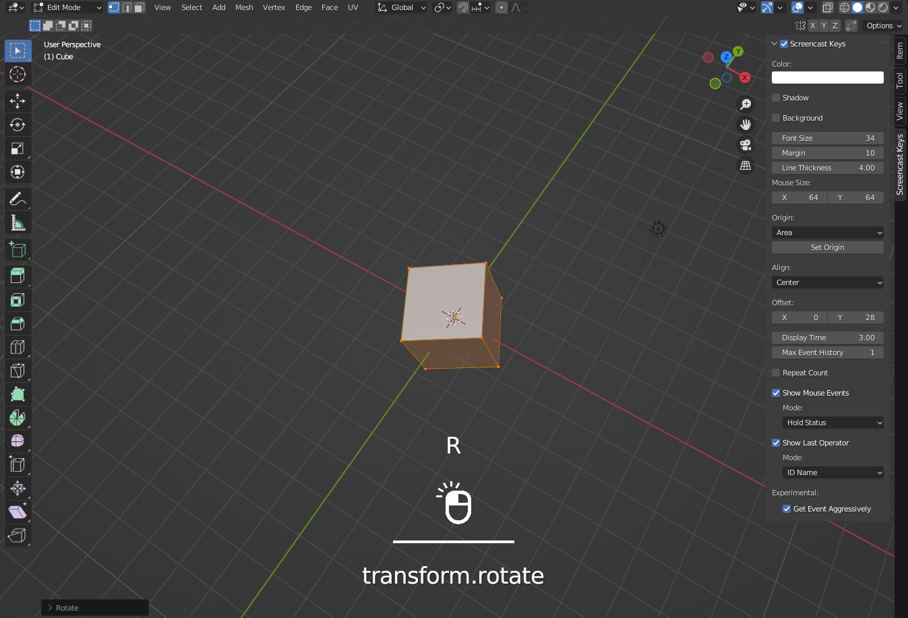

## Options

Screencast Keys add-on has lots of options to change its UI and operation.

### Color

**Color** option changes colors of text and figures.

### Shadow

If **Shadow** option is enabled, shadow will be displayed behind texts.  
You can also change shadow color.

### Backgroud

If **Background** option is enabled, colored planes will be displayed behind
texts and figures.  
Background color is changeable.  
**Background Mode** changes the display style for the background.

|||
|---|---|
|**Text**|Display colored plane behind texts and figures.|
|**Draw Area**|Display a color plane on the draw area rectangle.|

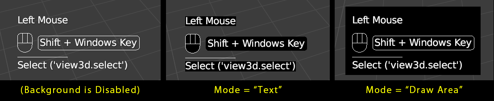

The background will have rounded corners with **Corner Radius** value.  
If this value is 0, the rounded corners are disabled.

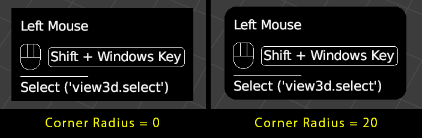

### Font Size

**Font Size** option specifies the size of texts.

### Margin

**Margin** option makes the spaces around the texts.  

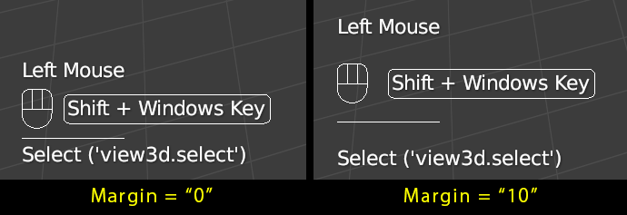

### Line Thickness

**Line Thickness** option specifies the thickness of lines.

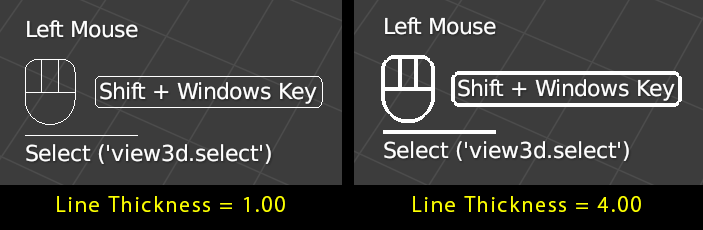

### Mouse Size

**Mouse Size** option specifies the size of figure which displays hold mouse
status.  
This option is only availabe when **Show Mouse Events** option's mode is
**Hold Status** or **Event History + Hold Status**.

When **Use Custom Mouse Image** option is enabled, **Use Image Size** option
helps you to set the mouse size same as the base image size.

### Origin

**Origin** option specifies the location to display texts and figures.

<!-- markdownlint-disable MD013 -->

|||
|---|---|
|**Region**|Currently selected region. You can change the region by **Set Origin** operation.|
|**Area**|Currently selected area. You can change the area by **Set Origin** operation.|
|**Window**|Blender's application window.|
|**Cursor**|Mouse cursor.|

<!-- markdownlint-enable MD013 -->

### Align

Texts and figures are aligned according to **Align** option.

|||
|---|---|
|**Left**|Texts and figures will be aligned to the left side.|
|**Center**|Texts and figures will be aligned to center.|
|**Right**|Texts and figures will be aligned to the right side.|

### Offset

**Offset** option is an offset of the location where texts and figures will be
displayed.

### Display Time

Each key event or last operator will be displayed until the elapsed time overs
**Display Time**.

### Max Event History

Key events will be displayed up to **Max Event History**.  
If you change **Max Event History** option to 1, show only last key event.

### Repeat Count

Repeated key will be displayed as the single string. (eg: Tab x5)

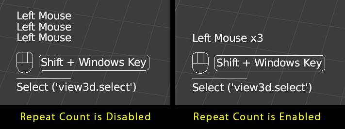

### Show Mouse Events

If **Show Mouse Events** option is enabled, events from mouse will be
displayed.  
You can change the display mode from **Mode** option.  

<!-- markdownlint-disable MD013 -->

|||
|---|---|
|**Event History**|Events from mouse will be displayed as events history as well as events from keyboard.|
|**Hold Status**|Hold mouse button status will be displayed as figure.|
|**Event History + Hold Status**|Both **Event History** and **Hold Status**.|

<!-- markdownlint-enable MD013 -->

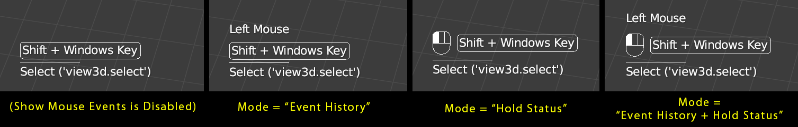

### Show Last Operators

If **Show Last Operators** option is enabled, the last executed operator will
be displayed.  
You can change the display mode from **Mode** option.  

|||
|---|---|
|**Label**|Label (`bl_label`) of operator will be displayed.|
|**ID Name**|ID Name (`bl_idname`) of operator will be displayed.|
|**Label + ID Name**|Both **Label** and **ID Name**.|

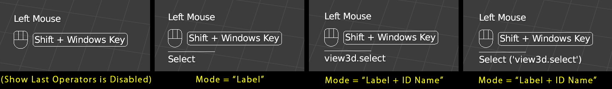

### Get Event Aggressively

*NOTE: This option is available for Blender 4.1 or before. For Blender 4.2 or*
*later, all events can be collected without this option.*

*NOTE: This is an experimental option. If this option is enabled, Blender may*
*be crashed in the specific environment.*

If **Get Event Aggressively** option is enabled, the events raised in the modal
status will also be displayed.

### Auto Save

*NOTE: This is an experimental option. If this option is enabled, Blender may*
*be crashed in the specific environment.*

If **Auto Save** option is enabled, the add-on simulates Blender's auto saving
(.blend file) feature.

## Preferences

In addition to the above options, some options are located on Preferences.  
You can update this add-on from Preferences.

### Use Custom Mouse Image

**Use Custom Mouse Image** option enables to show custom mouse image.  
You can choose the images following case.

* Base
  * This image is always displayed.
* Left
  * This image is displayed when a left mouse button is clicked.
  * This image is overlaid on the base image when **Display Mode** option is **Overlay**.
* Right
  * This image is displayed when a right mouse button is clicked.
  * This image is overlaid on the base image when **Display Mode** option is **Overlay**.
* Middle
  * This image is displayed when a middle mouse button is clicked.
  * This image is overlaid on the base image when **Display Mode** option is **Overlay**.

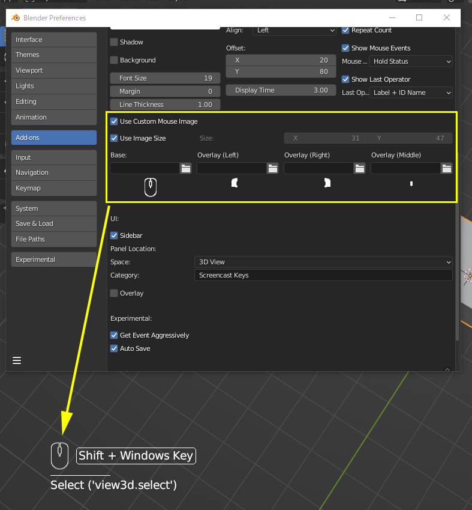

### Enable On Startup

If this option is enabled, Screencast Keys will be enabled automatically when
blender will startup up.

### UI

#### Sidebar

If this option is enabled, the Screencast Key's menu will be added to the
sidebar.
The location of the Panel can be changed by using **Space** option and
**Category** option.

|||
|---|---|
|**Space**|Space which this panel is placed on.|
|**Category**|The category name of this panel.|

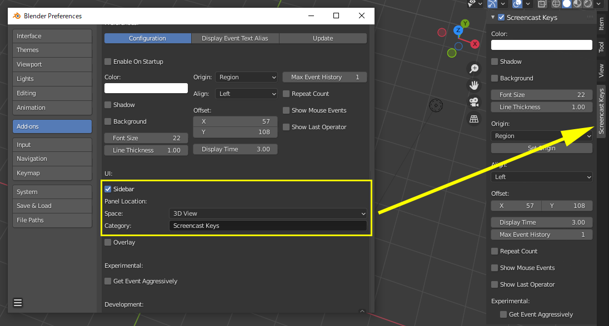

#### Overlay

If this option is enabled, the Screencast Key's menu will be added to the
**Viewport Overlays**.

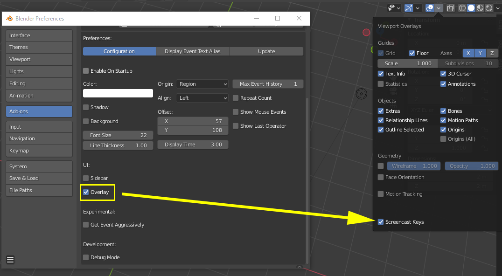

### Development

*NOTE: These options are for the development purpose. If these options are*
*enabled, the performance issue may be raised.*

#### Output Debug Log

Output logs for the analysis of bugs and so on.

#### Display Draw Area

Display 'Draw Area' where Screencast Keys UI will be rendered.

### Enable Display Event Text Aliases

If this options is enabled, you can display own customized strings for events
instead of default key name.  
This can be useful when you want to display events from special input devices.

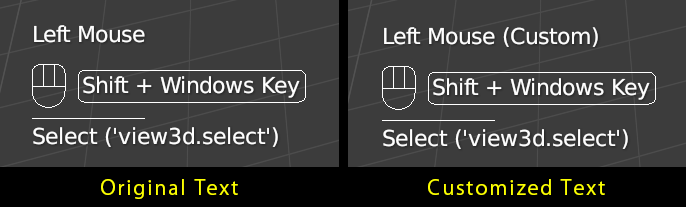

## Shortcut Keys

|Shortcut Keys|Description|
|---|---|
|Shift + Alt + C|Enable/Disable Screencast Keys|
