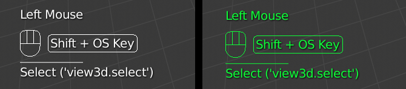
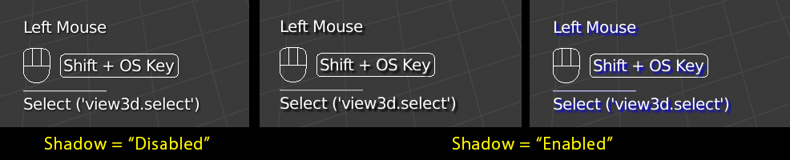
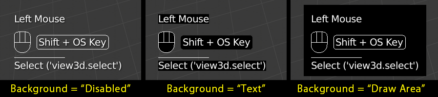
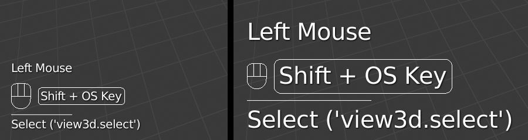
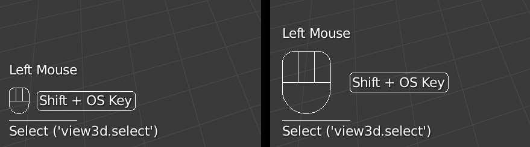
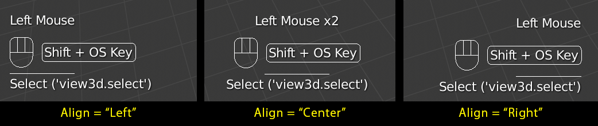
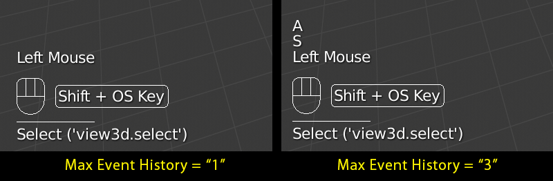
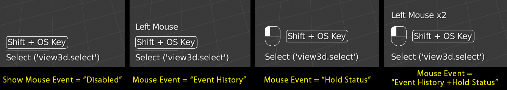
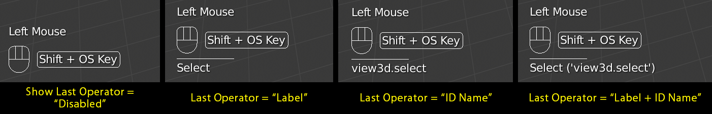
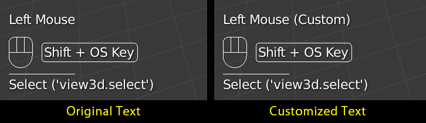

# Tutorial

* [Introduction (Video)](#introduction-video)
* [Options](#options)
* [Preferences](#preferences)
* [Shortcut Keys](#shortcut-keys)

## Introduction (Video)

This video is created for v3.0.

*NOTE: UI and features introduced in this video will be changed in the future release.*

## Options

Screencast Keys add-on has lots of options to change its UI and operation.

### Color

**Color** option changes colors of text and figures.

### Shadow

If **Shadow** option is enabled, shadow will be displayed behind texts.  
You can also change shadow color.

### Backgroud

If **Background** option is enabled, colored planes will be displayed behind texts and figures.  
Two background options are available.  
You can also change backgroud color.

|||
|---|---|
|**Text**|Display colored plane behind texts and figures.|
|**Draw Area**|Display a color plane on the draw area rectangle.|

### Font Size

**Font Size** option specifies the size of texts.

### Mouse Size

**Mouse Size** option specifies the size of figure which displays hold mouse status.  
This option is only availabe when **Mouse Events** option is **Hold Status** or **Event History + Hold Status** while **Show Mouse Events** is enabled.

### Origin

**Origin** option specifies the location to display texts and figures.

|||
|---|---|
|**Region**|Currently selected region. You can change the region by **Set Origin** operation.|
|**Area**|Currently selected area. You can change the area by **Set Origin** operation.|
|**Window**|Blender's application window.|
|**Cursor**|Mouse cursor.|

### Align

Texts and figures are aligned according to **Align** option.

|||
|---|---|
|**Left**|Texts and figures will be aligned to the left side.|
|**Center**|Texts and figures will be aligned to center.|
|**Right**|Texts and figures will be aligned to the right side.|

### Offset

**Offset** option is an offset of the location where texts and figures will be displayed.

### Display Time

Each key event or last operator will be displayed until the elapsed time overs **Display Time**.

### Max Event History

Key events will be displayed up to **Max Event History**.  
If you change **Max Event History** option to 1, show only last key event.

### Show Mouse Event

If **Show Mouse Event** option is enabled, events from mouse will be displayed.  
You can also display mouse button hold status as figure.  
See **Mouse Event** option if you want to change how to display the mouse status.

### Mouse Event

**Mouse Event** option specifies how to display the mouse status.

|||
|---|---|
|**Event History**|Events from mouse will be displayed as events history as well as events from keyboard.|
|**Hold Status**|Hold mouse button status will be displayed as figure.|
|**Event History + Hold Status**|Both **Event History** and **Hold Status**.|

### Show Last Operator

If **Show Last Operator** option is enabled, the last executed operator will be displayed.  
See **Last Operator** option if you want to change how to display the last operator.

### Last Operator

**Last Operator** option specifies how to display the last operator.

|||
|---|---|
|**Label**|Label (`bl_label`) of operator will be displayed.|
|**ID Name**|ID Name (`bl_idname`) of operator will be displayed.|
|**Label + ID Name**|Both **Label** and **ID Name**.|

### Get Event Aggressively

*NOTE: This is an experimental option. If this option is enabled, Blender may be crashed in the specific environment.*

*NOTE: This option is only supported in the specific Blender version. If you want this add-on to support other version, consider to [make a Issue](https://github.com/nutti/Screencast-Keys/issues)*

If **Get Event Aggressively** option is enabled, the events raised in the modal status will also be displayed.

## Preferences

In addition to the above options, some options are located on Perferences.  
You can update this add-on from Preferences.

### Panel Location

The location of the Panel can be changed.

|||
|---|---|
|**Space**|Space which this panel is placed on.|
|**Category**|The category name of this panel.|

### Debug Mode

*NOTE: This option is for the development purpose. If this option is enabled, the performance issue may be raised.*

Output logs for the analysis of bugs and so on.

### Enable Display Event Text Aliases

If this options is enabled, you can display own customized strings for events instead of default key name.  
This can be useful when you want to display events from special input devices.

## Shortcut Keys

|Shortcut Keys|Description|
|---|---|
|Shift + Alt + C|Enable/Disable Screencast Keys|
